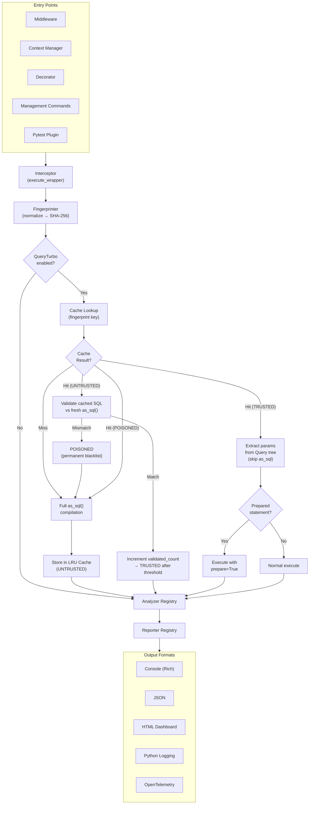
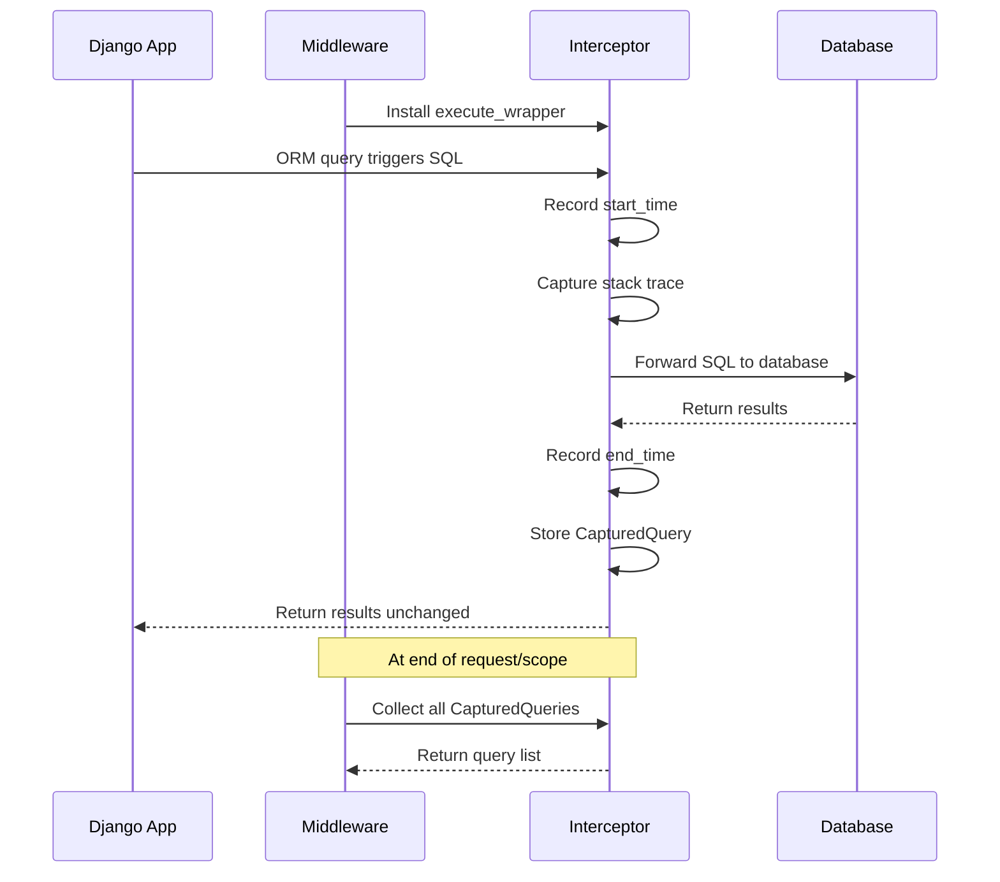
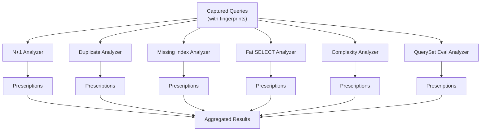

# Architecture

django-query-doctor is built around a four-stage pipeline: **Intercept, Fingerprint, Analyze, Report**. Every query that passes through the pipeline is captured, normalized, analyzed for optimization issues, and reported with actionable prescriptions.

---

## High-Level Overview



Each entry point activates the same core pipeline. The only difference is how and when the pipeline is triggered:

| Entry Point | Scope | Use Case |
|-------------|-------|----------|
| `QueryDoctorMiddleware` | Per HTTP request | Development and staging servers |
| `diagnose_queries()` context manager | Arbitrary code block | Testing, scripts, ad-hoc analysis |
| `@diagnose` decorator | Single function/method | View-level analysis |
| `check_queries` / `diagnose_project` management commands | One URL / entire URL set | Endpoint checks and full project scans, CI/CD |
| Pytest plugin | Per test or test suite | Automated regression detection |

---

## Stage 1: Intercept

The interceptor captures every SQL query executed within its scope using Django's `connection.execute_wrapper()` API.

### Why execute_wrapper?

Django provides `connection.execute_wrapper()` as a public, stable API for wrapping database cursor execution. Unlike monkey-patching or reading `connection.queries`, this approach:

- Works with `DEBUG=False` (production-safe)
- Is officially supported and documented by Django
- Composes cleanly with other wrappers (e.g., Sentry, OpenTelemetry)
- Does not modify global state

See [Background & Design](./background.md) for a detailed comparison of approaches.

### What Gets Captured

For every SQL query, the interceptor records:

| Field | Type | Description |
|-------|------|-------------|
| `sql` | `str` | The raw SQL string with parameter placeholders |
| `params` | `tuple` | The bound parameters for this query |
| `start_time` | `float` | `time.perf_counter()` timestamp before execution |
| `end_time` | `float` | `time.perf_counter()` timestamp after execution |
| `duration_ms` | `float` | `(end_time - start_time) * 1000` |
| `stack_trace` | `list[FrameInfo]` | Filtered call stack leading to user code |
| `connection_alias` | `str` | The database alias (e.g., `"default"`) |

### Stack Trace Filtering

Raw `traceback.extract_stack()` output includes many frames from Django internals, database drivers, and django-query-doctor itself. The `stack_tracer` module filters these down to only the frames that originate in user code:

```python
# stack_tracer.py filters out frames from:
IGNORED_MODULES = [
    "django/",
    "query_doctor/",
    "rest_framework/",
    "site-packages/",
    "importlib/",
    "<frozen ",
]
```

The result is a clean stack trace pointing directly to the line of user code that triggered the query.

### Interceptor Flow



> **Note:** The interceptor never modifies queries, parameters, or results. It is purely observational. If the interceptor encounters an internal error, it logs a warning and allows the query to proceed normally.

---

## Stage 2: Fingerprint

The fingerprinter normalizes each captured SQL query into a canonical form and generates a SHA-256 hash. This fingerprint is the foundation for N+1 and duplicate detection.

### Normalization Steps

1. **Parameter replacement**: All literal values (numbers, strings, lists) are replaced with `?` placeholders.
2. **Whitespace normalization**: Multiple spaces, tabs, and newlines are collapsed to single spaces.
3. **Case normalization**: SQL keywords are uppercased; identifiers are preserved.
4. **Comment removal**: SQL comments (`-- ...` and `/* ... */`) are stripped.
5. **IN-list normalization**: `IN (?, ?, ?, ?)` is normalized to `IN (?)` regardless of the number of parameters.

### Example

```
Input:  SELECT "books_book"."id", "books_book"."title"
        FROM "books_book"
        WHERE "books_book"."author_id" = 42
        ORDER BY "books_book"."title" ASC

Output: SELECT "books_book"."id", "books_book"."title"
        FROM "books_book"
        WHERE "books_book"."author_id" = ?
        ORDER BY "books_book"."title" ASC

Hash:   a1b2c3d4e5f6... (SHA-256 of normalized SQL)
```

Queries that differ only in their parameter values produce the same fingerprint. This is how the analyzer detects N+1 patterns: 50 queries for different `author_id` values all hash to the same fingerprint.

---

## Stage 3: Analyze

The analyzer stage passes the list of captured queries (with fingerprints) through a registry of analyzer classes. Each analyzer detects one specific category of optimization issue.

### Analyzer Registry



Each analyzer implements the `BaseAnalyzer` abstract class:

```python
class BaseAnalyzer(ABC):
    """Base class for all query analyzers."""

    @abstractmethod
    def analyze(self, queries: list[CapturedQuery]) -> list[Prescription]:
        """Analyze captured queries and return prescriptions."""
        ...
```

### The Prescription Dataclass

Every issue detected by an analyzer is represented as a `Prescription`:

| Field | Type | Description |
|-------|------|-------------|
| `severity` | `Severity` | `CRITICAL`, `WARNING`, or `INFO` |
| `category` | `str` | Issue category (e.g., `"n_plus_one"`, `"duplicate"`) |
| `description` | `str` | Human-readable description of the issue |
| `file_path` | `str \| None` | Absolute path to the source file |
| `line_number` | `int \| None` | Line number in the source file |
| `current_code` | `str \| None` | The code that causes the issue |
| `suggested_fix` | `str \| None` | The code that resolves the issue |
| `query_count` | `int` | Number of queries involved |
| `fingerprint` | `str \| None` | The query fingerprint (for N+1 / duplicate) |
| `time_saved_ms` | `float \| None` | Estimated time savings if fixed |

### Analyzer Details

**N+1 Analyzer** (`nplusone.py`): Groups queries by fingerprint. If a fingerprint appears more than `N_PLUS_ONE_THRESHOLD` times and the SQL pattern matches a ForeignKey or ManyToMany access pattern (single-row lookup by PK/FK), it is flagged as N+1. The stack trace is used to identify the source location, and the fix suggests the appropriate `select_related()` or `prefetch_related()` call.

**Duplicate Analyzer** (`duplicate.py`): Detects exact duplicates only — same SQL text and same bound parameters, executed more than `threshold` times within a request. It does not detect near-duplicates (same fingerprint, different parameters); those are more likely an N+1 pattern, handled by `NPlusOneAnalyzer`.

**Missing Index Analyzer** (`missing_index.py`): Examines WHERE and JOIN clauses for column references, then checks Django model meta information to determine if those columns are indexed. Suggests `Meta.indexes` with `models.Index()` for missing indexes.

**Fat SELECT Analyzer** (`fat_select.py`): Detects `SELECT *` patterns (or selecting all model fields) when the code only accesses a subset of fields. Suggests `.only()` or `.values()` calls.

**Complexity Analyzer** (`complexity.py`): Scores query complexity based on the number of JOINs, subqueries, CASE expressions, and aggregate functions. Flags queries above a configurable threshold.

**QuerySet Eval Analyzer** (`queryset_eval.py`): Detects unnecessary queryset evaluations such as calling `.count()` on an already-evaluated queryset, or iterating over a queryset multiple times.

**SerializerMethodField Analyzer** (`serializer_method.py`): A separate, static-only analyzer — it does not participate in the runtime pipeline above. It statically parses DRF `SerializerMethodField` `get_<field>` methods with Python's `ast` module and flags N+1-prone access patterns, invoked explicitly via the `check_serializers` management command rather than through `analyze(queries)`.

---

## Stage 4: Report

The reporter stage takes the aggregated prescriptions and formats them for output. Multiple reporters can be active simultaneously.

### Reporter Formats

| Reporter | Module | Output |
|----------|--------|--------|
| Console | `reporters/console.py` | Rich-formatted terminal output (falls back to plain text) |
| JSON | `reporters/json_reporter.py` | Structured JSON for CI/CD and tooling |
| HTML | `reporters/html_reporter.py` | Interactive HTML dashboard |
| Log | via Python `logging` | Standard log output at configurable level |
| OpenTelemetry | via spans/events | Query metrics as OTel attributes |

The console reporter uses Rich for colored, formatted output when available:

```
============================================================
  QUERY DOCTOR REPORT - GET /api/books/
  Total queries: 151 | Time: 340ms
============================================================

CRITICAL  N+1 Query Detected
          47 queries match fingerprint: SELECT * FROM books_author WHERE id = ?
          ...
```

If Rich is not installed, it falls back to plain text with the same information.

---

## Module Structure

```
src/query_doctor/
|-- __init__.py              # Package init, version
|-- middleware.py             # Django middleware entry point
|-- interceptor.py           # execute_wrapper, CapturedQuery storage
|-- fingerprint.py           # SQL normalization and hashing
|-- stack_tracer.py          # Stack trace capture and filtering
|-- conf.py                  # Settings with defaults
|-- decorators.py            # @diagnose, @query_budget
|-- context_managers.py      # diagnose_queries() context manager
|-- exceptions.py            # QueryDoctorError hierarchy
|-- types.py                 # Shared type definitions
|-- fixer.py                 # Auto-fix code generation
|-- diff_filter.py           # Git diff-aware filtering for CI
|-- ignore.py                # .queryignore rules
|-- plugin_api.py            # Analyzer discovery (built-in + entry points)
|-- project_diagnoser.py     # Full-project scanning logic
|-- pytest_plugin.py         # Pytest plugin for test-time analysis
|-- celery_integration.py    # Celery task wrapper
|-- url_discovery.py         # URL pattern discovery for management commands
|-- baseline.py              # Baseline snapshots for regression checks
|-- grouping.py              # Prescription grouping strategies
|-- admin_panel.py           # Django admin dashboard integration
|-- urls.py                  # URL configuration for the admin dashboard
|-- apps.py                  # AppConfig (QueryTurbo patching hook)
|-- py.typed                 # PEP 561 marker
|-- analyzers/
|   |-- __init__.py
|   |-- base.py              # BaseAnalyzer ABC
|   |-- nplusone.py          # N+1 detection
|   |-- duplicate.py         # Duplicate query detection
|   |-- missing_index.py     # Missing index detection
|   |-- fat_select.py        # Fat SELECT detection
|   |-- complexity.py        # Query complexity scoring
|   |-- queryset_eval.py     # Unnecessary queryset evaluation
|   |-- serializer_method.py # Static AST analysis of DRF SerializerMethodFields
|   |-- discovery.py         # Serializer class discovery for check_serializers
|-- filters/
|   |-- file_filter.py       # --file/--module prescription filtering
|-- reporters/
|   |-- console.py           # Rich/plain text console output
|   |-- json_reporter.py     # JSON output
|   |-- log_reporter.py      # Python logging output
|   |-- html_reporter.py     # HTML report renderer
|   |-- project_report.py    # diagnose_project HTML report
|   |-- dashboard.py         # QueryTurbo benchmark dashboard
|   |-- otel_exporter.py     # OpenTelemetry span exporter
|-- management/
|   |-- commands/
|       |-- check_queries.py       # Single-URL analysis for CI
|       |-- check_serializers.py   # Static DRF serializer analysis
|       |-- diagnose_project.py    # Full project scan
|       |-- fix_queries.py         # Auto-fix engine CLI
|       |-- query_budget.py        # Query budget enforcement
|       |-- query_doctor_report.py # QueryTurbo benchmark report
|-- turbo/                   # QueryTurbo SQL compilation cache
```

---

## Threading and Concurrency

### Per-Instance ContextVar Storage

django-query-doctor stores all per-request state in `contextvars.ContextVar` instances. Each `QueryInterceptor` instance gets its own unique `ContextVar`, ensuring isolation across both threads and concurrent async coroutines.

```python
# interceptor.py
import contextvars

_interceptor_counter = 0

class QueryInterceptor:
    def __init__(self, capture_stack: bool = True) -> None:
        global _interceptor_counter
        _interceptor_counter += 1
        self._queries_var: contextvars.ContextVar[list[CapturedQuery] | None] = (
            contextvars.ContextVar(
                f"query_doctor_queries_{_interceptor_counter}",
                default=None,
            )
        )
        self._queries_var.set([])
```

This ensures that concurrent requests in both multi-threaded WSGI servers (e.g., gunicorn with sync workers) and ASGI servers (e.g., uvicorn, daphne) do not interfere with each other.

### Async Django Support

The query interceptor and the QueryTurbo context managers hold their state in `contextvars.ContextVar`.

Concurrent ASGI requests do not contaminate each other's reports. This is covered by `tests/test_asgi_middleware_chain.py::TestConcurrentRequestIsolation`, which drives ten interleaved requests through a real `ASGIHandler`, each issuing a different number of queries, and asserts that every report holds exactly its own count.

Django's `execute_wrapper()` is per-connection, and Django stores connections in thread-local storage. Under ASGI that makes *which thread the middleware runs on* decisive: it must be the same thread the ORM runs on, or the wrapper is installed on a connection object the queries never touch. `QueryDoctorMiddleware` therefore declares `async_capable = False`, so Django adapts it with `sync_to_async(thread_sensitive=True)` and runs it in the same thread-sensitive executor it runs ORM work in.

This is the behaviour from 2.1.2 onwards. Releases 2.0.0 through 2.1.1 declared `async_capable = True` and, under ASGI, either crashed the middleware chain or captured nothing. See [Async Support](../guides/async-support.md) for the mechanism in full, including the per-request `ThreadSensitiveContext` Django opens in `django/core/handlers/asgi.py`.

> **Warning:** If you use raw `asyncio` database drivers that bypass Django's ORM (e.g., direct `asyncpg` calls), django-query-doctor will not capture those queries. It only intercepts queries that go through Django's database backend.

### No Global State

The following guarantees hold:

- No module-level mutable variables (lists, dicts, sets) are used for query storage. Per-request state uses `contextvars.ContextVar`.
- Configuration is read once per process via `conf.get_config()` (LRU-cached), which merges Django settings over the defaults.
- Analyzers are stateless: they receive a query list as input and return prescriptions as output. No state is retained between invocations.
- Reporters are stateless: they receive prescriptions and produce output.

---

## Extension Points

django-query-doctor is designed to be extended without modifying its source code.

| Extension Point | Mechanism | Example |
|-----------------|-----------|---------|
| Custom analyzers | Subclass `BaseAnalyzer`, register via the `query_doctor.analyzers` entry point group | Detect queries on deprecated tables |
| Analyzer toggles | `QUERY_DOCTOR["ANALYZERS"][<name>]["enabled"]` | Disable `fat_select` project-wide |
| Ignore rules | `.queryignore` file at the project root | Skip known findings in legacy code |
| Query budgets | `@query_budget(max_queries=N, max_time_ms=T)` decorator or the `query_budget` command | Enforce per-view limits |
| Diff filtering | `check_queries --diff <git-ref>` | Only report issues in changed code |

### Custom Analyzer Example

```python
from query_doctor.analyzers.base import BaseAnalyzer
from query_doctor.types import IssueType, Prescription, Severity

class DeprecatedTableAnalyzer(BaseAnalyzer):
    """Detect queries against deprecated database tables."""

    name = "deprecated_table"

    DEPRECATED_TABLES = {"legacy_users", "old_orders", "temp_cache"}

    def analyze(self, queries, models_meta=None):
        prescriptions = []
        for query in queries:
            for table in self.DEPRECATED_TABLES:
                if table in query.sql.lower():
                    prescriptions.append(
                        Prescription(
                            issue_type=IssueType.QUERY_COMPLEXITY,
                            severity=Severity.WARNING,
                            description=f"Query accesses deprecated table: {table}",
                            fix_suggestion=f"Migrate away from {table} to the new schema.",
                            callsite=query.callsite,
                            query_count=1,
                        )
                    )
        return prescriptions
```

See the [Custom Plugins Guide](../guides/custom-plugins.md) for registration via entry points.

For more on the design rationale behind these choices, see [Background & Design](./background.md). For performance characteristics, see [Performance](./performance.md).
