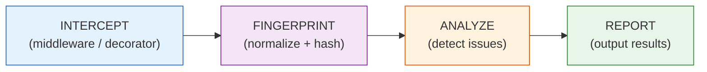
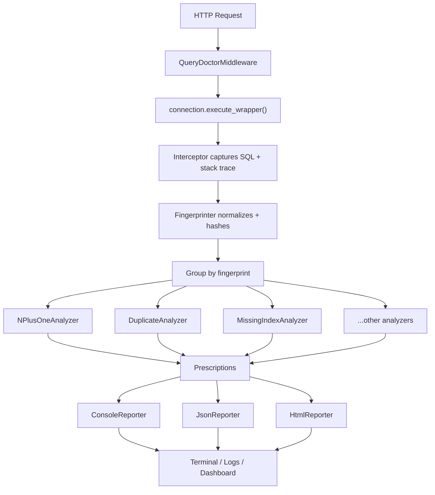

# How It Works

django-query-doctor uses a four-stage pipeline to intercept, identify, analyze, and report on query performance issues. This page explains each stage and how they connect.

---

## The Four-Stage Pipeline

### Stage 1: Intercept

django-query-doctor hooks into Django's database layer using `connection.execute_wrapper()`. This is a low-level mechanism that wraps **every SQL call** at the database connection level, not at the ORM or model layer. This means:

- It captures raw SQL regardless of how it was generated (ORM, raw queries, third-party libraries).
- It works **without** `DEBUG=True` (unlike `connection.queries`).
- It captures the full stack trace for each query, allowing precise file:line attribution.

The interceptor is installed by the middleware at the start of each request and removed at the end. You can also install it manually using the `@diagnose` decorator or the `diagnose_queries()` context manager.

> **Key design decision:** We intentionally use `execute_wrapper` instead of `connection.queries` because the latter requires `DEBUG=True` and does not capture stack traces. Our approach works in production and staging environments without configuration changes.

### Stage 2: Fingerprint

Every captured SQL query is normalized and hashed to produce a **fingerprint**:

1. **Normalization** -- Literal values (`WHERE id = 42`) are replaced with placeholders (`WHERE id = ?`). `IN` clauses are collapsed (`IN (?, ?, ?)` becomes `IN (?+)`).
2. **Hashing** -- The normalized SQL string is hashed with SHA-256 to produce a compact, deterministic identifier.
3. **Grouping** -- Queries with the same fingerprint are grouped together. A group of 50 queries with the same fingerprint is a strong signal of an N+1 problem.

This fingerprint-based approach is what distinguishes django-query-doctor from simple query counters. Two queries that differ only in parameter values are recognized as the "same" query.

### Stage 3: Analyze

Grouped queries are passed through a chain of **analyzers**, each responsible for detecting a single category of issue. Every analyzer receives the full list of captured queries (with fingerprints, stack traces, and timing data) and returns zero or more **Prescriptions**.

| Analyzer | Detects | Guide |
|---|---|---|
| `NPlusOneAnalyzer` | N+1 query patterns from FK/M2M traversal | [N+1 Queries](../analyzers/nplusone.md) |
| `DuplicateAnalyzer` | Exact and near-duplicate queries within one request | [Duplicates](../analyzers/duplicate.md) |
| `MissingIndexAnalyzer` | `WHERE`/`ORDER BY` on columns without indexes | [Missing Indexes](../analyzers/missing-index.md) |
| `FatSelectAnalyzer` | `SELECT *` when only a few columns are used | [Fat SELECT](../analyzers/fat-select.md) |
| `QuerysetEvalAnalyzer` | Unnecessary queryset evaluations (e.g., calling `.count()` after `.all()`) | [Queryset Evaluation](../analyzers/queryset-eval.md) |
| `DRFSerializerAnalyzer` | N+1 patterns inside DRF serializers | [DRF Serializer](../analyzers/drf-serializer.md) |
| `QueryComplexityAnalyzer` | Overly complex queries (too many JOINs, subqueries) | [Query Complexity](../analyzers/query-complexity.md) |

Analyzers are independent and stateless. You can enable or disable each one individually via settings.

### Stage 4: Report

Prescriptions from all analyzers are collected and passed to one or more **reporters**. Reporters format the results for different consumption targets:

| Reporter | Output |
|---|---|
| `ConsoleReporter` | Rich-formatted terminal output (falls back to plain text if Rich is not installed) |
| `JsonReporter` | Structured JSON for CI/CD pipelines and tooling |
| `HtmlReporter` | Self-contained HTML page for the admin dashboard |
| `LogReporter` | Python `logging` integration |
| `OtelReporter` | OpenTelemetry spans and attributes |

---

## What Is a Prescription?

Every issue detected by an analyzer is returned as a **Prescription** dataclass. This is the core data structure of django-query-doctor. A Prescription contains:

| Field | Type | Description |
|---|---|---|
| `severity` | `Severity` enum | One of `CRITICAL`, `WARNING`, `INFO` |
| `analyzer` | `str` | Name of the analyzer that produced this prescription |
| `issue` | `str` | Human-readable description of the problem |
| `table` | `str` | Database table involved |
| `location` | `Location` | Source file path and line number where the issue originates |
| `fix` | `str` | A ready-to-apply code fix (e.g., `.select_related('author')`) |
| `query_count` | `int` | Number of queries involved in this issue |
| `time_saved_ms` | `float` | Estimated time savings if the fix is applied |
| `fingerprint` | `str` | The SHA-256 fingerprint of the query group |

Prescriptions are not just warnings. They are actionable: the `fix` field contains the exact code change you need to make, and the `location` field tells you exactly where to make it.

---

## Connection-Level, Not ORM-Level

A common question is whether django-query-doctor works with raw SQL or only with ORM queries. Because interception happens at the **database connection level** (`connection.execute_wrapper`), it captures all SQL that passes through Django's database backend:

- ORM queries (`Model.objects.filter(...)`)
- Raw queries (`connection.cursor().execute(...)`)
- Queries from third-party packages (django-rest-framework, django-filter, etc.)
- Queries from Django internals (sessions, auth, content types)

The stack tracer then maps each query back to your source code, filtering out Django internals and third-party code to show you only the lines **you** control.

---

## Data Flow Diagram

---

## Further Reading

- [Middleware Setup](middleware.md) -- How to install and configure the middleware.
- [Management Commands](management-commands.md) -- Run analysis without the middleware.
- [Custom Plugins](custom-plugins.md) -- Write your own analyzer.
