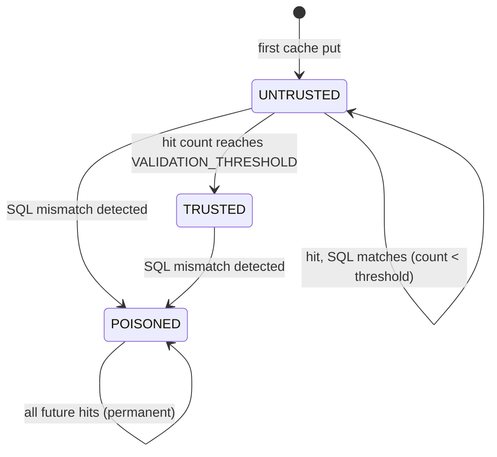

# QueryTurbo

QueryTurbo reduces SQL compilation overhead by caching compiled query structures and extracting parameters directly from Django's Query tree, bypassing repeated calls to `SQLCompiler.as_sql()`. It is an opt-in feature introduced in v2.0 that accelerates repeat queries within a single process.

---

## How It Works

### The 3-Phase Cache Lifecycle

Every cached query goes through a trust lifecycle before QueryTurbo will skip the full `as_sql()` compilation:



**UNTRUSTED** — When a query fingerprint is first cached, the entry starts in the UNTRUSTED state. On each subsequent cache hit, QueryTurbo runs a fresh `as_sql()` call and compares the result against the cached SQL. If the SQL matches, the entry's `validated_count` is incremented. Once `validated_count` reaches `VALIDATION_THRESHOLD` (default: **3**), the entry is promoted to TRUSTED.

**TRUSTED** — The `as_sql()` call is skipped entirely. Instead, parameters are extracted directly from the Django `Query` tree's `WhereNode` structure. This is the fast path that provides the compilation-skip speedup.

**POISONED** — If at any point the cached SQL does not match a fresh `as_sql()` result (a fingerprint collision), the entry is permanently marked as POISONED. Poisoned fingerprints are stored in a separate set (`_poisoned_fps`) that:

- Survives `cache.clear()` (which is triggered by the `post_migrate` signal)
- Lives for the lifetime of the process
- Is only cleared by `cache.hard_reset()` (used in tests)
- Causes all future `get()` calls for that fingerprint to return `None` immediately (treated as a cache miss, falls back to `as_sql()`)

### What Gets Cached

- The compiled SQL template (with `%s` placeholders)
- The parameter count
- Trust state and validation counter
- Model label (for diagnostics)
- Hit count

### What Is Never Cached

- User-supplied filter values (parameters)
- Query results (rows returned from the database)
- Raw SQL strings from `RawQuerySet`

---

## Enabling QueryTurbo

Add the `TURBO` section to your `QUERY_DOCTOR` settings:

```python
# settings.py
QUERY_DOCTOR = {
    "TURBO": {
        "ENABLED": True,
    },
}
```

QueryTurbo is disabled by default. All other settings have sensible defaults.

### Full Configuration Reference

| Key | Type | Default | Description |
|-----|------|---------|-------------|
| `ENABLED` | `bool` | `False` | Enable or disable QueryTurbo. Must be set to `True` to activate. |
| `MAX_SIZE` | `int` | `1024` | Maximum number of entries in the LRU cache. Oldest non-poisoned entries are evicted when full. |
| `SKIP_RAW_SQL` | `bool` | `True` | Skip caching for `RawQuerySet` and `Manager.raw()` queries. When `False`, raw SQL is fingerprinted and cached, but parameter extraction may be unreliable. |
| `SKIP_EXTRA` | `bool` | `True` | Skip caching for queries using `.extra()`. |
| `SKIP_SUBQUERIES` | `bool` | `True` | Skip caching for queries containing subqueries. |
| `PREPARE_ENABLED` | `bool` | `True` | Enable prepared statement support for compatible backends (PostgreSQL + psycopg3). |
| `PREPARE_THRESHOLD` | `int` | `5` | Number of executions before a query is promoted to use prepared statements. |
| `VALIDATION_THRESHOLD` | `int` | `3` | Number of successful SQL validations before an entry is promoted from UNTRUSTED to TRUSTED. |

```python
# settings.py — full example with all defaults shown
QUERY_DOCTOR = {
    "TURBO": {
        "ENABLED": True,
        "MAX_SIZE": 1024,
        "SKIP_RAW_SQL": True,
        "SKIP_EXTRA": True,
        "SKIP_SUBQUERIES": True,
        "PREPARE_ENABLED": True,
        "PREPARE_THRESHOLD": 5,
        "VALIDATION_THRESHOLD": 3,
    },
}
```

---

## Prepared Statements (PostgreSQL + psycopg3)

When `PREPARE_ENABLED` is `True` and the database backend uses **psycopg3** (the `psycopg` package, not `psycopg2`), QueryTurbo uses protocol-level prepared statements for TRUSTED queries. This saves the database from re-parsing and re-planning the same SQL on every execution.

### How to Verify psycopg3 Is in Use

```python
import django.db.backends.postgresql.base
# psycopg3 uses "psycopg", psycopg2 uses "psycopg2"
print(django.db.backends.postgresql.base.Database.__name__)
```

### What `PREPARE_THRESHOLD` Controls

After a query has been executed `PREPARE_THRESHOLD` times (default: 5), the prepared statement strategy passes `prepare=True` to `cursor.execute()`. This tells psycopg3 to create a server-side prepared statement for subsequent executions.

### Fallback Behavior

If the database backend does not support prepared statements (or if `prepare=True` raises a `TypeError`), QueryTurbo permanently disables prepared statements for that vendor and falls back to normal execution. This happens silently — no error is raised.

### Backend-Specific Strategies

| Backend | Strategy | Behavior |
|---------|----------|----------|
| PostgreSQL + psycopg3 | `Psycopg3PrepareStrategy` | Protocol-level prepared statements via `prepare=True` |
| Oracle | `OraclePrepareStrategy` | Implicit cursor caching (cx_Oracle handles this internally) |
| MySQL | `NoPrepareStrategy` | No-op — compilation cache only |
| SQLite | `NoPrepareStrategy` | No-op — compilation cache only |
| PostgreSQL + psycopg2 | `NoPrepareStrategy` | No-op — psycopg2 does not support `prepare=True` |

```python
# Enable prepared statements (requires psycopg3)
QUERY_DOCTOR = {
    "TURBO": {
        "ENABLED": True,
        "PREPARE_ENABLED": True,
        "PREPARE_THRESHOLD": 5,
    },
}
```

---

## Multi-Database Support

QueryTurbo works with all Django-supported database backends:

| Backend | Compilation Cache | Prepared Statements | Notes |
|---------|:-:|:-:|---|
| PostgreSQL (psycopg3) | Yes | Yes | Full support including protocol-level prepared statements |
| PostgreSQL (psycopg2) | Yes | No | Compilation cache only; psycopg2 lacks `prepare=True` |
| MySQL | Yes | No | Compilation cache only |
| SQLite | Yes | No | Compilation cache only; useful for development and testing |
| Oracle | Yes | Implicit | Oracle's cursor cache handles statement reuse internally |

The compilation cache is per-process and shared across all database aliases within a process. Each query fingerprint includes the database alias, so queries against different databases do not collide.

---

## Monitoring QueryTurbo

### Reading Cache Statistics

```python
from query_doctor.turbo.cache import SQLCompilationCache
from query_doctor.turbo.stats import TurboStats

# Get the cache instance (imported from patch module)
from query_doctor.turbo.patch import _cache

stats_collector = TurboStats()
snapshot = stats_collector.snapshot(_cache)

print(f"Cache hits:      {snapshot['total_hits']}")
print(f"Cache misses:    {snapshot['total_misses']}")
print(f"Hit rate:        {snapshot['hit_rate']:.1%}")
print(f"Cache size:      {snapshot['cache_size']} / {snapshot['max_size']}")
print(f"Evictions:       {snapshot['evictions']}")
print(f"Trusted entries: {snapshot['trusted_entries']}")
print(f"Poisoned entries:{snapshot['poisoned_entries']}")
print(f"Trusted hits:    {snapshot['trusted_hits']}")
```

The snapshot dict contains:

| Field | Type | Description |
|-------|------|-------------|
| `total_hits` | `int` | Total cache hits |
| `total_misses` | `int` | Total cache misses |
| `hit_rate` | `float` | `hits / (hits + misses)` |
| `cache_size` | `int` | Current number of cached entries |
| `max_size` | `int` | Maximum cache capacity |
| `evictions` | `int` | Number of LRU evictions |
| `trusted_entries` | `int` | Entries in TRUSTED state |
| `poisoned_entries` | `int` | Fingerprints in POISONED state |
| `trusted_hits` | `int` | Cache hits that skipped `as_sql()` |
| `top_queries` | `list` | Top 20 queries by hit count |
| `prepare_stats` | `dict` | Prepared vs non-prepared counts |

### Benchmark Dashboard

Generate an interactive HTML report:

```bash
python manage.py query_doctor_report
python manage.py query_doctor_report --output=my_report.html
```

See [Benchmark Dashboard](benchmark-dashboard.md) for details.

---

## Context Managers

Temporarily enable or disable QueryTurbo for a code block:

```python
from query_doctor.turbo.context import turbo_enabled, turbo_disabled

# Force-enable turbo for a block (even if globally disabled)
with turbo_enabled():
    # queries here use the compilation cache
    books = list(Book.objects.filter(published=True))

# Force-disable turbo for a block (even if globally enabled)
with turbo_disabled():
    # queries here always use standard as_sql()
    books = list(Book.objects.filter(published=True))
```

---

## Compilation-Skip Benchmarks

When a query reaches TRUSTED state, the `as_sql()` call is skipped entirely. Measured on SQLite (compilation-only, no DB I/O):

| Query Pattern | Speedup | Saved per Query |
|---|---|---|
| Simple filter | 123x | 38.8 μs |
| Multi filter | 153x | 49.2 μs |
| select_related | 294x | 92.5 μs |
| Deep select_related | 374x | 121.1 μs |
| Annotate | 214x | 68.6 μs |
| Complex (JOINs + Q + annotate) | 1,050x | 337.9 μs |

Run `python benchmarks/run.py` to reproduce these numbers on your hardware.

On PostgreSQL with psycopg3, prepared statements provide additional savings of 0.5--5ms of query planner time per repeat query.

---

## Limitations

1. **Case/When expressions** — Queries using Django's `Case(When(...))` are cached but the parameter extraction path uses `When.as_sql()` as a fallback. If the fallback fails, the query falls back to source expression traversal. These queries execute correctly but may not achieve the full TRUSTED speedup.

2. **Raw SQL** — `RawQuerySet` and `Manager.raw()` are bypassed entirely when `SKIP_RAW_SQL = True` (the default). When set to `False`, raw SQL is fingerprinted and cached, but parameter extraction is not guaranteed to be correct for hand-written SQL.

3. **Cache cleared on migration** — The `post_migrate` signal calls `cache.clear()`, which removes all LRU entries and resets counters. All entries restart from UNTRUSTED after a migration run. However, poisoned fingerprints survive the clear and persist for the lifetime of the process.

4. **Process-local** — The cache is in-memory per process. In multi-process deployments (gunicorn with multiple workers), each worker maintains its own independent cache. There is no shared state across processes.

5. **Custom SQL compilers** — Third-party packages that override `SQLCompiler` or `SQLCompiler.execute_sql()` may be incompatible. The QueryTurbo patch wraps the standard Django `SQLCompiler.execute_sql()` method.

6. **`.extra()` and subqueries** — By default, queries using `.extra()` (`SKIP_EXTRA = True`) and queries containing subqueries (`SKIP_SUBQUERIES = True`) are not cached due to the complexity of parameter extraction.

---

## Further Reading

- [Configuration](../getting-started/configuration.md) — Full settings reference
- [Performance & Benchmarks](../deep-dive/performance.md) — Overhead model and benchmark methodology
- [Architecture](../deep-dive/architecture.md) — How QueryTurbo fits in the pipeline
- [Management Commands](management-commands.md) — CLI tools including `query_doctor_report`
- [Benchmark Dashboard](benchmark-dashboard.md) — Interactive HTML report
