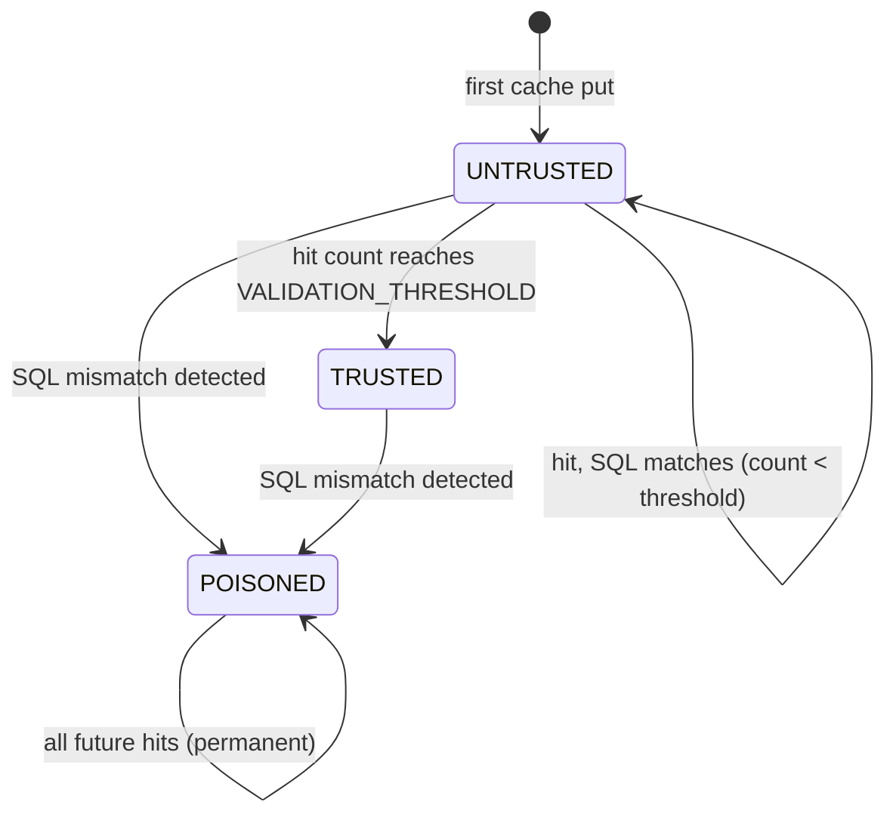

# QueryTurbo

QueryTurbo reduces SQL compilation overhead by caching compiled query structures and extracting parameters directly from Django's Query tree, bypassing repeated calls to `SQLCompiler.as_sql()`. It is an opt-in feature introduced in v2.0 that accelerates repeat queries within a single process.

---

## How It Works

### The 3-Phase Cache Lifecycle

Every cached query goes through a trust lifecycle before QueryTurbo will skip the full `as_sql()` compilation:


```mermaid
stateDiagram-v2
    [*] --> UNTRUSTED: first cache put
    UNTRUSTED --> UNTRUSTED: hit, SQL matches (count < threshold)
    UNTRUSTED --> TRUSTED: hit count reaches VALIDATION_THRESHOLD
    UNTRUSTED --> POISONED: SQL mismatch detected
    TRUSTED --> POISONED: SQL mismatch detected
    POISONED --> POISONED: all future hits (permanent)
```

**UNTRUSTED** — When a query fingerprint is first cached, the entry starts in the UNTRUSTED state. On each subsequent cache hit, QueryTurbo runs a fresh `as_sql()` call and compares the result against the cached SQL. If the SQL matches, the entry's `validated_count` is incremented. Once `validated_count` reaches `VALIDATION_THRESHOLD` (default: **3**), the entry is promoted to TRUSTED.

**TRUSTED** — The `as_sql()` call is skipped entirely. Instead, parameters are extracted directly from the Django `Query` tree's `WhereNode` structure. This is the fast path that provides the compilation-skip speedup.

**POISONED** — If at any point the cached SQL does not match a fresh `as_sql()` result (a fingerprint collision), the entry is permanently marked as POISONED. Poisoned fingerprints are stored in a separate set (`_poisoned_fps`) that:

- Survives `cache.clear()` (which is triggered by the `post_migrate` signal)
- Lives for the lifetime of the process
- Is only cleared by `cache.hard_reset()` (used in tests)
- Causes all future `get()` calls for that fingerprint to return `None` immediately (treated as a cache miss, falls back to `as_sql()`)

### What Gets Cached

- The compiled SQL template (with `%s` placeholders)
- The parameter count
- Trust state and validation counter
- Model label (for diagnostics)
- Hit count

### What Is Never Cached

- User-supplied filter values (parameters)
- Query results (rows returned from the database)
- Raw SQL strings from `RawQuerySet`

---

## When to Enable QueryTurbo

Enable QueryTurbo if your application meets these conditions:

- **PostgreSQL with psycopg3** — gives the full benefit: compilation skip +
  protocol-level prepared statements
- **High-frequency identical-structure queries** — the same ORM pattern executes
  100+ times per process lifetime (pagination, list views, API endpoints
  with consistent filters)
- **Complex queries** — JOINs, annotations, Q objects benefit most from skipping
  compilation (up to 337 μs saved per query)
- **Long-lived processes** — gunicorn workers, Celery workers, or Django dev server
  sessions where the TRUSTED state (reached after 3 validations) is maintained

**Do not enable on:**

- SQLite databases (development or testing) — fingerprinting overhead exceeds
  compilation savings; end-to-end performance is worse
- Short-lived processes (serverless, AWS Lambda) — cache never warms up to TRUSTED
- If you use `RawQuerySet` or `Manager.raw()` exclusively — these bypass QueryTurbo
  entirely (`SKIP_RAW_SQL = True` by default)

---

## Enabling QueryTurbo

Add the `TURBO` section to your `QUERY_DOCTOR` settings:

```python
# settings.py
QUERY_DOCTOR = {
    "TURBO": {
        "ENABLED": True,
    },
}
```

QueryTurbo is disabled by default. All other settings have sensible defaults.

### Full Configuration Reference

| Key | Type | Default | Description |
|-----|------|---------|-------------|
| `ENABLED` | `bool` | `False` | Enable or disable QueryTurbo. Must be set to `True` to activate. |
| `MAX_SIZE` | `int` | `1024` | Maximum number of entries in the LRU cache. Oldest non-poisoned entries are evicted when full. |
| `SKIP_RAW_SQL` | `bool` | `True` | Skip caching for `RawQuerySet` and `Manager.raw()` queries. When `False`, raw SQL is fingerprinted and cached, but parameter extraction may be unreliable. |
| `SKIP_EXTRA` | `bool` | `True` | Skip caching for queries using `.extra()`. |
| `SKIP_SUBQUERIES` | `bool` | `True` | Skip caching for queries containing subqueries. |
| `PREPARE_ENABLED` | `bool` | `True` | Enable prepared statement support for compatible backends (PostgreSQL + psycopg3). |
| `PREPARE_THRESHOLD` | `int` | `5` | Number of executions before a query is promoted to use prepared statements. |
| `VALIDATION_THRESHOLD` | `int` | `3` | Number of successful SQL validations before an entry is promoted from UNTRUSTED to TRUSTED. |

```python
# settings.py — full example with all defaults shown
QUERY_DOCTOR = {
    "TURBO": {
        "ENABLED": True,
        "MAX_SIZE": 1024,
        "SKIP_RAW_SQL": True,
        "SKIP_EXTRA": True,
        "SKIP_SUBQUERIES": True,
        "PREPARE_ENABLED": True,
        "PREPARE_THRESHOLD": 5,
        "VALIDATION_THRESHOLD": 3,
    },
}
```

---

## Prepared Statements (PostgreSQL + psycopg3)

When `PREPARE_ENABLED` is `True` and the database backend uses **psycopg3** (the `psycopg` package, not `psycopg2`), QueryTurbo uses protocol-level prepared statements for TRUSTED queries. This saves the database from re-parsing and re-planning the same SQL on every execution.

### How to Verify psycopg3 Is in Use

```python
import django.db.backends.postgresql.base
# psycopg3 uses "psycopg", psycopg2 uses "psycopg2"
print(django.db.backends.postgresql.base.Database.__name__)
```

### What `PREPARE_THRESHOLD` Controls

After a query has been executed `PREPARE_THRESHOLD` times (default: 5), the prepared statement strategy passes `prepare=True` to `cursor.execute()`. This tells psycopg3 to create a server-side prepared statement for subsequent executions.

### Fallback Behavior

If the database backend does not support prepared statements (or if `prepare=True` raises a `TypeError`), QueryTurbo permanently disables prepared statements for that vendor and falls back to normal execution. This happens silently — no error is raised.

### Backend-Specific Strategies

| Backend | Strategy | Behavior |
|---------|----------|----------|
| PostgreSQL + psycopg3 | `Psycopg3PrepareStrategy` | Protocol-level prepared statements via `prepare=True` |
| Oracle | `OraclePrepareStrategy` | Implicit cursor caching (cx_Oracle handles this internally) |
| MySQL | `NoPrepareStrategy` | No-op — compilation cache only |
| SQLite | `NoPrepareStrategy` | No-op — compilation cache only |
| PostgreSQL + psycopg2 | `NoPrepareStrategy` | No-op — psycopg2 does not support `prepare=True` |

```python
# Enable prepared statements (requires psycopg3)
QUERY_DOCTOR = {
    "TURBO": {
        "ENABLED": True,
        "PREPARE_ENABLED": True,
        "PREPARE_THRESHOLD": 5,
    },
}
```

---

## Multi-Database Support

QueryTurbo works with all Django-supported database backends:

| Backend | Compilation Cache | Prepared Statements | Notes |
|---------|:-:|:-:|---|
| PostgreSQL (psycopg3) | Yes | Yes | Full support including protocol-level prepared statements |
| PostgreSQL (psycopg2) | Yes | No | Compilation cache only; psycopg2 lacks `prepare=True` |
| MySQL | Yes | No | Compilation cache only |
| SQLite | Yes | No | Compilation cache only; useful for development and testing |
| Oracle | Yes | Implicit | Oracle's cursor cache handles statement reuse internally |

The compilation cache is per-process and shared across all database aliases within a process. Each query fingerprint includes the database alias, so queries against different databases do not collide.

!!! note "CI verification status"
    The full test suite runs against SQLite. Backend-specific strategies for PostgreSQL
    (psycopg3 prepared statements), MySQL (SQL-template cache), and Oracle
    (implicit cursor caching) are code-complete and unit-tested for strategy
    selection logic. End-to-end integration tests against live PostgreSQL, MySQL,
    and Oracle databases are not yet in CI.

    If you encounter unexpected behavior on a non-SQLite backend, please
    [open an issue](https://github.com/hassanzaibhay/django-query-doctor/issues).

---

## Monitoring QueryTurbo

### Reading Cache Statistics

```python
from query_doctor.turbo.cache import SQLCompilationCache
from query_doctor.turbo.stats import TurboStats

# Get the cache instance (imported from patch module)
from query_doctor.turbo.patch import _cache

stats_collector = TurboStats()
snapshot = stats_collector.snapshot(_cache)

print(f"Cache hits:      {snapshot['total_hits']}")
print(f"Cache misses:    {snapshot['total_misses']}")
print(f"Hit rate:        {snapshot['hit_rate']:.1%}")
print(f"Cache size:      {snapshot['cache_size']} / {snapshot['max_size']}")
print(f"Evictions:       {snapshot['evictions']}")
print(f"Trusted entries: {snapshot['trusted_entries']}")
print(f"Poisoned entries:{snapshot['poisoned_entries']}")
print(f"Trusted hits:    {snapshot['trusted_hits']}")
```

The snapshot dict contains:

| Field | Type | Description |
|-------|------|-------------|
| `total_hits` | `int` | Total cache hits |
| `total_misses` | `int` | Total cache misses |
| `hit_rate` | `float` | `hits / (hits + misses)` |
| `cache_size` | `int` | Current number of cached entries |
| `max_size` | `int` | Maximum cache capacity |
| `evictions` | `int` | Number of LRU evictions |
| `trusted_entries` | `int` | Entries in TRUSTED state |
| `poisoned_entries` | `int` | Fingerprints in POISONED state |
| `trusted_hits` | `int` | Cache hits that skipped `as_sql()` |
| `top_queries` | `list` | Top 20 queries by hit count |
| `prepare_stats` | `dict` | Prepared vs non-prepared counts |

### Benchmark Dashboard

Generate an interactive HTML report:

```bash
python manage.py query_doctor_report
python manage.py query_doctor_report --output=my_report.html
```

See [Benchmark Dashboard](benchmark-dashboard.md) for details.

---

## Context Managers

Temporarily enable or disable QueryTurbo for a code block:

```python
from query_doctor.turbo.context import turbo_enabled, turbo_disabled

# Force-enable turbo for a block (even if globally disabled)
with turbo_enabled():
    # queries here use the compilation cache
    books = list(Book.objects.filter(published=True))

# Force-disable turbo for a block (even if globally enabled)
with turbo_disabled():
    # queries here always use standard as_sql()
    books = list(Book.objects.filter(published=True))
```

### Setting the override manually

Both context managers are built on `set_turbo_override()`, which the 2.2.0
release notes name as the replacement for the removed
`turbo.patch.set_thread_override`. Use it directly when the scope you want to
override does not line up with a `with` block. It returns a
`contextvars.Token`, and you are responsible for handing that token back to
`reset_turbo_override()`:

```python
from query_doctor.turbo.context import get_turbo_override, reset_turbo_override
from query_doctor.turbo.context import set_turbo_override

token = set_turbo_override(False)
try:
    assert get_turbo_override() is False  # turbo is off for this thread/coroutine
    books = list(Book.objects.filter(published=True))
finally:
    reset_turbo_override(token)
```

`get_turbo_override()` returns `True` when force-enabled, `False` when
force-disabled, and `None` when no override is in force and the global
`TURBO.ENABLED` setting decides. Prefer `turbo_enabled()` / `turbo_disabled()`
unless you need the manual form: they pair the set and the reset for you,
including on an exception.

---

## Compilation-Skip Benchmarks

When a query reaches TRUSTED state, the `as_sql()` call is skipped entirely. Measured on SQLite (compilation-only, no DB I/O):

!!! important "What these numbers measure"
    The speedup figures below measure **SQL compilation overhead only** —
    the time Django spends in `SQLCompiler.as_sql()` constructing the SQL
    template before executing it against the database.

    They do **not** measure total query time including database round-trip.

    **When QueryTurbo helps most:** high-frequency endpoints where the same
    query structure executes repeatedly (pagination, list views, API endpoints
    with consistent filters). The benefit grows with query complexity — complex
    queries with JOINs, annotations, and Q objects save the most compilation time.

    **When QueryTurbo adds overhead:** low-latency backends (SQLite, in-memory
    databases) where query execution is faster than the fingerprinting cost.
    On SQLite in-memory, end-to-end benchmarks show QueryTurbo adds ~35%
    overhead. On PostgreSQL with real network latency (1–5ms per query), the
    compilation saving is meaningful.

### Reproducing these numbers

`python benchmarks/run.py` writes `benchmarks/results.json` with **two**
sections, and the table below is the `compilation_only` one. Read that
distinction before running the command, because the last thing it prints is
the *other* section:

```text
Total baseline: 9,872.8ms
Total turbo: 15,707.6ms
Total saved: -5,834.8ms
Overall speedup: 0.63x
Cache hit rate: 100.0%
```

That `0.63x` is real and is not a defect. It is the **end-to-end** suite on
SQLite in-memory, where a query executes faster than QueryTurbo's
fingerprinting costs, so the cache is a net loss. It is the same fact the
"When QueryTurbo adds overhead" note above states, measured. The
compilation-only table is what QueryTurbo actually claims to improve; on a
backend with real network latency the compilation saving is not cancelled out
this way.

| Query Pattern | Speedup | Saved per Query |
|---|---|---|
| Simple filter | 85.5x | 32.9 μs |
| Multi filter | 109.5x | 42.0 μs |
| select_related | 202.4x | 78.1 μs |
| Deep select_related | 260.5x | 101.5 μs |
| Annotate | 152.5x | 59.2 μs |
| Complex (JOINs + Q + annotate) | 523.4x | 204.3 μs |

Measured on one machine: Windows 11, Intel64 Family 6 Model 141, Python
3.12.0, Django 6.0.7, SQLite 3.42.0, `compilation_only` section of
`benchmarks/results.json`.

!!! warning "These figures replace a set that did not reproduce"
    Through 2.2.0 this table published 123x / 153x / 294x / 374x / 214x /
    1,050x, and a "hardware variance" note giving the complex scenario a range
    of 727x–1,050x. Re-measured with the documented command, every value came
    back 30–50% lower, and the complex scenario measured **523.4x** -- below
    the stated floor, so the disclosure was wrong as well as the numbers.

    The values above are one run on one named machine, not a range. Ordering
    and order of magnitude are stable across runs and machines; the absolute
    values are not, so treat a run of yours that disagrees by tens of percent
    as information about your host. The honest summary is that compilation
    caching is worth 1.5 to 2.5 orders of magnitude on the compilation step
    alone, and that the end-to-end effect depends entirely on how slow your
    database is relative to Python.

On PostgreSQL with psycopg3, prepared statements provide additional savings of 0.5–5ms of query planner time per repeat query.

---

## Limitations

1. **Case/When expressions** — Queries using Django's `Case(When(...))` are cached but the parameter extraction path uses `When.as_sql()` as a fallback. If the fallback fails, the query falls back to source expression traversal. These queries execute correctly but may not achieve the full TRUSTED speedup.

2. **Raw SQL** — `RawQuerySet` and `Manager.raw()` are bypassed entirely when `SKIP_RAW_SQL = True` (the default). When set to `False`, raw SQL is fingerprinted and cached, but parameter extraction is not guaranteed to be correct for hand-written SQL.

3. **Cache cleared on migration** — The `post_migrate` signal calls `cache.clear()`, which removes all LRU entries and resets counters. All entries restart from UNTRUSTED after a migration run. However, poisoned fingerprints survive the clear and persist for the lifetime of the process.

4. **Process-local** — The cache is in-memory per process. In multi-process deployments (gunicorn with multiple workers), each worker maintains its own independent cache. There is no shared state across processes.

5. **Custom SQL compilers** — Third-party packages that override `SQLCompiler` or `SQLCompiler.execute_sql()` may be incompatible. The QueryTurbo patch wraps the standard Django `SQLCompiler.execute_sql()` method.

6. **`.extra()` and subqueries** — By default, queries using `.extra()` (`SKIP_EXTRA = True`) and queries containing subqueries (`SKIP_SUBQUERIES = True`) are not cached due to the complexity of parameter extraction.

---

## Further Reading

- [Configuration](../getting-started/configuration.md) — Full settings reference
- [Performance & Benchmarks](../deep-dive/performance.md) — Overhead model and benchmark methodology
- [Architecture](../deep-dive/architecture.md) — How QueryTurbo fits in the pipeline
- [Management Commands](management-commands.md) — CLI tools including `query_doctor_report`
- [Benchmark Dashboard](benchmark-dashboard.md) — Interactive HTML report
